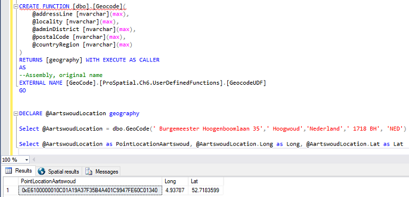
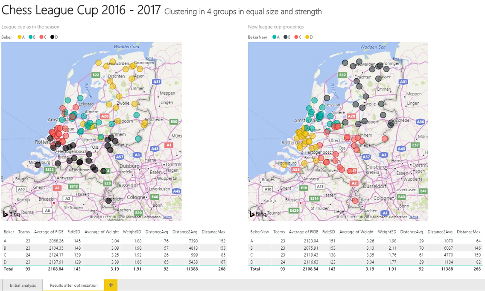

Optimizing Chess League Cup Pairings
================

In this article we investigate the pairings for the Chess League Cup in the Netherlands (season 2016–2017). I have some doubts about the quality of the classification of the participating chessclubs in 4 groups. We use different techniques to solve this optimization problem:

-   Power BI Visualization & Comparison

-   R (Optimization using OMPR & Visualization)

-   SQL Server (Geocoding address Chessclubs)

All the code is in Github, [ChessLeagueCup](https://github.com/Ruud-Janssen/ChessLeagueCup). You can view the Power BI report [here](https://app.powerbi.com/view?r=eyJrIjoiZWIzOTBiYmEtMzc5OC00NmE0LWJhMWItMmQyMDAwNzlkMTgwIiwidCI6Ijg3NGM1MzA1LWI0MDktNGU5Ni04ODhiLTQ4ODViNWQ0ZDYwNiIsImMiOjl9).

All the code can be found on GitHub [ChessLeagueCup](https://github.com/Ruud-Janssen/ChessLeagueCup).

Chess League Cup Explanation
----------------------------

As with football there is a League Cup and the regular national competition. Though the regular competition is a single round robin event of 10 teams. Just 9 games leaves plenty of time to play individual tournaments or multiple foreign league competitions. In the regular competition in the Netherlands you play with 10 players in the highest 2 classes and with 8 players per team in the lower classes.

In the League Cup you play with 4 players often during the week on the regular chess club evening of the home playing team. The League cup is based on a knockout system where around 100 teams participate. The teams are divided in 4 groups and the winners of each group go to the finals where the cup winner will be decided.

The 4 groups are divided in equal sized groups based on strength (based on level in national competition) and secondly on distance. So, one group in the North, East, West and South, right? Well not exactly, the Dutch chess teams are more or less divided according to population density in the country. The league cup games are played in the evening and can take over 4 hours. Short travelling distances are preferable. The teams in the North, South and East have to travel a lot as these areas are too small to form a single group. And yes, I happen to live and play chess in one of these regions...

The Problem
-----------

But the distance penalty seemed to be a bit unfair with long driving's (ok perspective of the Netherlands...). Of course an idea is to make 8 groups instead of 4 groups. Then play 3 games in the final weekend or 2 games in the final weekend and one battle with a neighboring group winner to qualify for the finals. The latter solution makes sense, but there are traditions for a reason.

Enough talk, let’s see whether the solution was optimized or whether my gut feeling was correct.

What do we need:

-   the clubs and their playing venue location

-   the national competition league of the club (for strength assessment)

-   the average rating of the teams (for strength assessment)

-   the group in the League Cup

As usually I work with the Microsoft stack, at least that’s where we start.

The first thing is to get the data of the chess clubs and optionally put it in a database, sql server. Unfortunately there is no webservice or something to get this data easily. I might could have asked for this data but I extracted the data from the website (at that point still [schaakbond.nl](www.schaakbond.nl) instead of the new website [schaken.nl](www.schaken.nl)).

I did some data wrangling/munging, sounds cooler than the just plain good old ETL/ELT. In this case it was mainly fixing small errors from the parsing. In the end I extracted the addresses of the 150 clubs in the national league and I looked up the addresses of the 10 champions from the regions. These are all the potential clubs which can participate in the league cup, though second teams are excluded.


In the next figure the team information is presented.

<table style="width:93%;">
<caption>Team information</caption>
<colgroup>
<col width="22%" />
<col width="70%" />
</colgroup>
<thead>
<tr class="header">
<th>Dutch name</th>
<th>Translation</th>
</tr>
</thead>
<tbody>
<tr class="odd">
<td><p>Klasse</p></td>
<td><p>National league</p></td>
</tr>
<tr class="even">
<td><p>Beker</p></td>
<td><p>Cup group</p></td>
</tr>
<tr class="odd">
<td><p>Team</p></td>
<td><p>TeamName (2 indicates second team of the club)</p></td>
</tr>
<tr class="even">
<td><p>KNSB and FIDE</p></td>
<td><p>Average strength of the team</p></td>
</tr>
<tr class="odd">
<td><p>KNSB</p></td>
<td><p>National rating</p></td>
</tr>
<tr class="even">
<td><p>FIDE</p></td>
<td><p>International rating</p></td>
</tr>
<tr class="odd">
<td><p>Gem. leeftijd</p></td>
<td><p>Average age of the team. As a BI-er I am very well aware of our habit to add data in the pipeline nobody needs...</p></td>
</tr>
</tbody>
</table>


Not every team participates in the league cup, therefor the blanks. There can be different reasons for not participating.

The next step is to calculate the location (latitude, longitude) of the club based on the playing venue address of the club. I use the method illustrated by Alastair Aitchison in his book *Pro Spatial with SQL Server 2012*, <https://alastaira.wordpress.com/2012/05/04/geocoding-in-sql-server-with-the-bing-maps-locations-api/>. So a typical call to get the sql server geography object looks like this.



There are different ways to get the latitude longitude coordinate, but it is not our intention to discuss this in detail. Now we import the data in Power BI Desktop and create some initial visualization to get a rough idea about the data. 

The brief EDA gave some clues that improvement does not seem impossible. On the left visualization we see the actual 4 league cup groups as played in the season 2016-2017. In the middle we see two versions of the k-means clustering with 4 and 8 clusters (groups), using R within Power BI. In this example strength and equal sized cluster are not considered, but it gives an idea about the data. On the right visualizations we see the division of strength over the club locations. The bottom right visualization is based on FIDE rating, while the upper visualization is based on the national league class.

Once again, my personal annoyance was that each year we play in group south, including some pretty far western clubs, while living in the east. More concretely, is the league cup already the optimal solution or is there a solution which is better in all relevant aspects. So what should we take into consideration:

-   Equal average strength (based on national league class)

-   Group size (equal sized groups)

-   Average distance and/or average squared distance in the group

Unfortunately, there is no magic button in Power BI to get the answer for this problem. Clustering algorithms have a different purpose, similarity, and cannot be used for this problem.

The solution can be found in linear optimization type of problems. Math is certainly not my expertise area, but let’s see whether we can come up with some results. As a Microsoft guy nowadays you need to be savvy with R, so lets fire up R studio!

I found a nice looking package from Dirk Schumacher, *OMPR*, Optimization Modelling Package. More information can be found [here](https://dirkschumacher.github.io/ompr/index.html). In general it works a bit like the package *Caret*, for Regression and Classification type of problems. It provides a universal front-end for many different optimization algorithms.

R
-

After importing the data in R, we do a little preprocessing before building the model. In the specific season we have 93 clubs participating in the league cup. We set the number of groups to 4, and the size of the group to a minimum of 23 clubs and a maximum of 24 clubs. We use the same weight setting as in Power BI. But we add the maximum and minimum weight for a group to ensure equal strength groups.

At development time I used a subset, for example 20 clubs and 4 groups, to quickly test the solution. I played a bit with the *OMPR* package and tried different approaches to solve the problem.

Some less successful attempts have been tried with different models. They are within R script *Optimize ChessLeagueCupGroupings.R* in GitHub. One of the attempts was the famous TSP, Traveling Salesman Problem. It wasn’t particularly successful as the problem space grew massively. But the idea was to have 4 chains of clubs equal in size and strength. Unfortunately, testing it with just 20 cities already took too long, while with 10 cities and 2 groups it was ok.

In this article we only examine final model. But first the preprocessing.

``` r
#rm(list=setdiff(ls(), "mapNL"))

library(ompr)
library(ROI.plugin.glpk)
library(ompr.roi)
library(ROI)
library(geosphere)
library(tidyr)
library(knitr)
library(ggplot2)
library(ggrepel)
library(ggmap)
```

Preprocessing
-------------

In the preprocessing we load the data from the already geocoded chessclubs, csv file, and set a few variables for the groupings.

``` r
source("Preprocessing ChessLeagueCup.R")
```

Create a basemap of the Netherlands once, and load it each time, see R script *loadRBaseMapOnce.R* at GitHub.

``` r
load("output/mapNL.rda")
```

Optimization Model
------------------

As a reminder we need to take into account similar strength and equal group sizes and reduce the overall distance between the clubs assigned to the 4 groups.

For our final solution a number of random points are choosen within the studyarea (added with the best points from previous runs). Then we choose the 4 most optimized points to create the 4 groups with a minimal (squared) distance from the clubs to the grouppoint (centroid approximation). Taking into account the constraints for equal strength and equal group sizes. The proposed solution is related to the following type of problem: finding the most optimal warehouse location to serve customers.

``` r
#Study area extent based on locations of the chessclub
minLat <- min(ChessClubs20162017$Lat)
maxLat <- max(ChessClubs20162017$Lat)
minLong <- min(ChessClubs20162017$Long)
maxLong <- max(ChessClubs20162017$Long)

deltaLat <- maxLat - minLat
deltaLong <- maxLong - minLong

centroidLoc <- 96

set.seed(12345)
centroid_locations <- data.frame(
  IdCentroid = 1:centroidLoc,
  LongCentroid = runif(centroidLoc) * deltaLong + minLong, #x
  LatCentroid = runif(centroidLoc) * deltaLat + minLat #y
)

#Add top centroid from previous run
df1 <- data.frame(IdCentroid = centroidLoc + 1, LongCentroid = 4.933878, LatCentroid = 52.38954)
df2 <- data.frame(IdCentroid = centroidLoc + 2, LongCentroid = 6.404083, LatCentroid = 52.64013)
df3 <- data.frame(IdCentroid = centroidLoc + 3, LongCentroid = 5.487537, LatCentroid = 51.88348)
df4 <- data.frame(IdCentroid = centroidLoc + 4, LongCentroid = 4.409887, LatCentroid = 51.88037)

centroid_locations <- rbind(centroid_locations, df1)
centroid_locations <- rbind(centroid_locations, df2)
centroid_locations <- rbind(centroid_locations, df3)
centroid_locations <- rbind(centroid_locations, df4)

#it was a bit too ambitious to have the study area crossing the North Sea, Belgium and Germany.
#Lets trim it a bit more
centroid_locations <- centroid_locations %>%
  filter(LongCentroid > 4.1) %>%
  filter(LongCentroid < 6.6) %>%
  filter(LatCentroid > 51.2) %>%
  filter(LatCentroid < 53.1)
```

We now have the random centroid locations. Let's visualize our data.

``` r
p <- ggmap(mapNL, extent = 'device') +
  geom_point(data = ChessClubs20162017, aes(Long, Lat), color = "blue") + 
  geom_point(data = centroid_locations, aes(x = LongCentroid, y = LatCentroid), color = "red", alpha = 0.5, shape = 17) +
  scale_x_continuous(limits = c(minLong, maxLong)) +
  scale_y_continuous(limits = c(minLat, maxLat)) 

p + 
#  geom_label_repel(data = centroid_locations, aes(x = LongCentroid, y = LatCentroid, label=as.character(IdCentroid)), box.padding #= 0.25, point.padding = 0.3, segment.color = 'grey50') +
  ggtitle("'Warehouse' location problem for Chess League Cup", "Blue dots are clubs, Light red triangles show potential centers.")
```


The suggested centroid locations look reasonable.

DistanceMatrix
--------------

We are almost ready to start crafting the optimization model. But it is a handy to make an initial Distance Matrix and not calculate again and again in the model optimization function. A squared distance is used as a distance measure. So it tries too limit larger distances. The distance function is not the driving distance though (this could be sort of *geocoded* as well).

``` r
centroidLoc <- nrow(centroid_locations)
m1 <- as.matrix(ChessClubs20162017[,c("Long", "Lat")])
m2 <- as.matrix(centroid_locations[,c("LongCentroid", "LatCentroid")])
md2 <- distm(m1, m2)

distanceCost2 <- function(i, j) {
  md2[i,j]^2
}

centroid_locations$Id <- row_number(centroid_locations$IdCentroid) #As some point locations are removed, create a new Id field
cl <- centroidLoc #a small variable names helps too read the model

rm(m1, m2, centroidLoc, df1, df2, df3, df4, deltaLong, deltaLat) #cleanup
```

Model
-----

Finally! The model is easy to read and understand. It was one of the reasons for choosing this package.

``` r
model4 <- MIPModel() %>%
  # 1 if i gets assigned to centroid_location j otherwise 0
  add_variable(x[i, j], i = 1:n, j = 1:cl, type = "binary") %>%
  
  #the centroid locations (dummy variable)
  add_variable(u[j], j = 1:cl, type = "binary") %>%
  
  #exactly 4 groups are allowed
  add_constraint(sum_expr(u[j], j = 1:cl) == 4) %>% 
  
  #minimize squared distance cost
  set_objective(sum_expr(distanceCost2(i, j) * x[i, j], i = 1:n, j = 1:cl), "min") %>%

  # every chessclub needs to be assigned to exactly one group
  add_constraint(sum_expr(x[i, j], j = 1:cl) == 1, i = 1:n) %>% 

  # each of the 4 groups has to be of equal size
  add_constraint(sum_expr(x[i, j], i = 1:n) >= gMin * u[j], j = 1:cl) %>%
  add_constraint(sum_expr(x[i, j], i = 1:n) <= gMax * u[j], j = 1:cl) %>%
  
  #each of the 4 groups has to be of equal strength
  add_constraint(sum_expr(x[i, j] * weightLevel[i], i = 1:n) >= minTotalWeight * u[j], j = 1:cl) %>%
  add_constraint(sum_expr(x[i, j] * weightLevel[i], i = 1:n) <= maxTotalWeight * u[j], j = 1:cl)

#Lets inspect the model created
# model4
```

Now we run the model using the glpk solver

``` r
result4 <- solve_model(model4, with_ROI(solver = "glpk", verbose = FALSE))

#Verbose = TRUE RESULTS:
#
# <SOLVER MSG>  ----
# GLPK Simplex Optimizer, v4.47
# 362 rows, 6298 columns, 31490 non-zeros
#       0: obj =  0.000000000e+000  infeas = 9.700e+001 (94)
# *   253: obj =  1.236354690e+012  infeas = 2.274e-015 (1)
# *   500: obj =  8.712538744e+011  infeas = 0.000e+000 (0)
# *  1000: obj =  4.987494456e+010  infeas = 6.297e-016 (0)
# *  1170: obj =  3.919634122e+010  infeas = 4.441e-017 (0)
# OPTIMAL SOLUTION FOUND
# GLPK Integer Optimizer, v4.47
# 362 rows, 6298 columns, 31490 non-zeros
# 6298 integer variables, all of which are binary
# Integer optimization begins...
# +  1170: mip =     not found yet >=              -inf        (1; 0)
# +  2031: >>>>>  2.471864739e+011 >=  4.263027948e+010  82.8% (62; 0)
# +  3528: mip =  2.471864739e+011 >=  4.554063146e+010  81.6% (178; 9)
# +  3992: >>>>>  1.727665160e+011 >=  4.554063146e+010  73.6% (215; 9)
# +  4617: mip =  1.727665160e+011 >=  4.795663865e+010  72.2% (233; 94)
# +  5276: mip =  1.727665160e+011 >=  4.966066692e+010  71.3% (296; 96)
# +  6340: >>>>>  1.696382545e+011 >=  5.055920563e+010  70.2% (391; 97)
# +  8332: mip =  1.696382545e+011 >=  6.906003480e+010  59.3% (464; 141)
# + 10888: mip =  1.696382545e+011 >=  7.399658740e+010  56.4% (555; 154)
# + 14071: mip =  1.696382545e+011 >=  8.485198381e+010  50.0% (654; 175)
# + 16789: mip =  1.696382545e+011 >=  8.858068210e+010  47.8% (748; 186)
# + 19080: mip =  1.696382545e+011 >=  9.103993846e+010  46.3% (880; 196)
# + 21765: mip =  1.696382545e+011 >=  9.421738460e+010  44.5% (1015; 209)
# + 23916: >>>>>  1.684059921e+011 >=  9.510877569e+010  43.5% (1152; 216)
# + 26363: mip =  1.684059921e+011 >=  9.623257085e+010  42.9% (1265; 243)
# Time used: 60.0 secs.  Memory used: 12.4 Mb.
# + 28563: mip =  1.684059921e+011 >=  9.675488984e+010  42.5% (1368; 252)
# + 28975: >>>>>  1.639851247e+011 >=  9.675488984e+010  41.0% (1394; 252)
# + 31055: mip =  1.639851247e+011 >=  9.711484369e+010  40.8% (1457; 337)
# + 32954: mip =  1.639851247e+011 >=  9.763099726e+010  40.5% (1569; 341)
# ....
# +407391: mip =  1.475556012e+011 >=  1.445187564e+011   2.1% (1537; 14992)
# +409331: mip =  1.475556012e+011 >=  1.447550892e+011   1.9% (1379; 15430)
# +412376: mip =  1.475556012e+011 >=  1.453694164e+011   1.5% (1063; 16520)
# +414237: mip =  1.475556012e+011 >=  1.458631693e+011   1.1% (800; 17603)
# +416131: mip =  1.475556012e+011 >=  1.464166437e+011   0.8% (548; 18778)
# +417674: mip =  1.475556012e+011 >=  1.468899638e+011   0.5% (276; 20493)
# +418064: >>>>>  1.472613739e+011 >=  1.471252795e+011 < 0.1% (188; 21463)
# +418316: mip =  1.472613739e+011 >=     tree is empty   0.0% (0; 24309)
# INTEGER OPTIMAL SOLUTION FOUND
# <!SOLVER MSG> ----
```

``` r
#choosen centroid locations
selected_centroid <- result4 %>% 
  get_solution(u[j]) %>%
  filter(value > 0) %>%
  select(j)


#Take group assignments
matching <- result4 %>% 
  get_solution(x[i,j]) %>%
  filter(value > 0) %>%  
  select(i, j)
```

Now we integrate the results and visualize the results.

``` r
plot_assignment <- matching %>% 
  inner_join(ChessClubs20162017, by = c("i" = "Id")) %>% 
  inner_join(centroid_locations, by = c("j" = "Id"))

p + 
  geom_segment(aes(x = LongCentroid, y = LatCentroid, xend = Long, yend = Lat), data = plot_assignment) + 
  geom_point(aes(x = LongCentroid, y = LatCentroid), data = centroid_locations[centroid_locations$Id %in% selected_centroid$j, ], color = "red", size = 3, shape = 17) +

  ggtitle("Optimal groups for the Chess League Cup",
          "Based on the possible centroid locations. 
Big red triangles show the 4 selected centroid locations. 
Light red are unused centroid locations, blue dots represent chessclubs.")
```


*And no, we still don't have mountains here...*

The results look like an improvement. Let's compare the results in Power BI. Therefor we first need to export the results. Export the data to csv.

``` r
#Some reordering and export
ChessClubs20162017New <- matching %>% 
  inner_join(ChessClubs20162017, by = c("i" = "Id"))

ChessClubs20162017New <- rename(ChessClubs20162017New, Id = i)

jGroups <- sort(unique(ChessClubs20162017New$j))
ChessClubs20162017New$BekerNew <- mapvalues(ChessClubs20162017New$j, from = jGroups, to = c("A", "B", "C", "D"))
ChessClubs20162017New$j <- NULL

write.csv(ChessClubs20162017New, file = "output\\leagueChessClub.csv")
```

Power BI
--------

The results in Power BI 

Well it seems my gutfeeling was about right. The average distance dropped with almost 10 km (20 km for roundtrip). Ok, the club in province North Holland need to use some bridges, but that seems acceptable. Everything appears better, apart from the SD Weight. It is a little higher for 1 group. This indicates there are more strong and weak teams compared tp the other groups. I think this is acceptable as well.

These statistics are created using DAX (measures), the most interesting is the DistanceAvg and Distance2Avg (squared) measures. They provide the average distance between the selected clubs (within the group in this case). In DAX we can do this in the following way:

    DistanceAvg = AVERAGEX( 
        FILTER(
            CROSSJOIN(
                SELECTCOLUMNS ( ChessLeagueCup; 
                  "Lat_1"; ChessLeagueCup[Lat]; 
                  "Long_1"; ChessLeagueCup[Long]; 
                  "ClubNaam1"; ChessLeagueCup[ClubNaam]);
                SELECTCOLUMNS ( ChessLeagueCup; 
                  "Lat_2"; ChessLeagueCup[Lat]; 
                  "Long_2"; ChessLeagueCup[Long]; 
                  "ClubNaam2"; ChessLeagueCup[ClubNaam])
           );
           [ClubNaam1] <> [ClubNaam2]
        ); 
        6371 *((2*ASIN(SQRT((SIN((RADIANS([Lat_1])-RADIANS([Lat_2]))/2)^2)+COS(RADIANS([Lat_1]))*COS(RADIANS([Lat_2]))*(SIN((RADIANS([Long_1])-RADIANS([Long_2]))/2)^2)))))
    )

It would have been nice if this can be added in a kind of UDF as now the formula is copied a couple of times.

After all these analysis, reporting and writing, it is time to do some real calculations again and bring home that Cup ones more!

You can view the Power BI report [here](https://app.powerbi.com/view?r=eyJrIjoiZWIzOTBiYmEtMzc5OC00NmE0LWJhMWItMmQyMDAwNzlkMTgwIiwidCI6Ijg3NGM1MzA1LWI0MDktNGU5Ni04ODhiLTQ4ODViNWQ0ZDYwNiIsImMiOjl9).

All the code can be found on GitHub [ChessLeagueCup](https://github.com/Ruud-Janssen/ChessLeagueCup).
